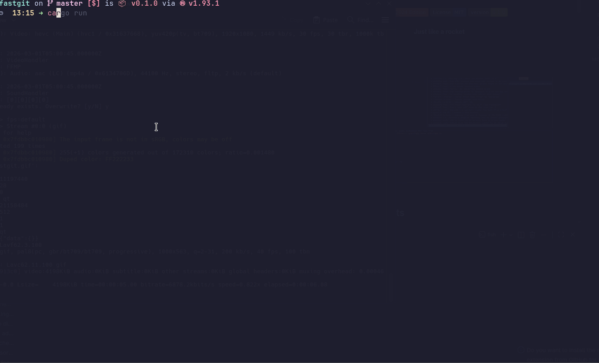

<div align="center">

# fastgit


**Just like a rocket**

</div>

---

## Interface


## Table of Contents

- [Philosophy](#philosophy)
- [Features](#features)
- [Installation](#installation)
  - [Prerequisites](#prerequisites)
  - [Build from source](#build-from-source)
  - [Run](#run)
- [Interface](#interface)
- [Keybindings](#keybindings)
  - [Navigation](#navigation)
  - [Git Actions](#git-actions)
  - [Branch & Remote](#branch--remote)
  - [Input Fields](#input-fields)
  - [File Status Icons](#file-status-icons)
- [Built With](#built-with)
- [License](#license)

---

## Philosophy

Kill friction. Boost productivity.

---

## Features

- **File tree**: live view of your working tree with git status icons
- **Commit graph**: scrollable history with per-commit diff
- **Staging**: stage and unstage files with a single keypress
- **Commit**: write summary + description in a split dialog
- **Push**: push to any configured remote, no extra prompts
- **Branch management**: create, switch, and checkout branches inline
- **Remote management**: add and delete remotes without leaving the UI
- **Auto-refresh**: repo state syncs every 3 seconds automatically
- **Auto-pull**: background pull runs every 60 seconds

---

## Installation

### Prerequisites

- Rust toolchain (`cargo`). [install via rustup](https://rustup.rs)

### Build from source

```bash
git clone https://github.com/ellenoireQ/fastgit
cd fastgit
cargo build --release
```

The binary will be at `target/release/fastgit`. Add it to your `$PATH`.

### Run

```bash
cd /your/repo
fastgit
```

---

## Keybindings

### Navigation

| Key | Action |
|-----|--------|
| `Tab` | Switch panel |
| `Up` / `Down` | Navigate list |
| `Left` / `Right` | Switch branch tab (Local / Remote) |
| `Enter` | Select file / checkout branch |
| `Esc` | Deselect / close dialog |
| `?` | Toggle help |
| `q` | Quit |

### Git Actions

| Key | Action |
|-----|--------|
| `Space` | Stage / unstage file |
| `c` | Commit staged changes |
| `P` | Push to remote |
| `s` | Rescan git status |

### Branch & Remote

| Key | Action |
|-----|--------|
| `n` | New branch (Local tab) |
| `Enter` | Checkout selected branch |
| `a` | Add remote (Remote tab) |
| `d` | Delete remote (Remote tab) |
| `Enter` | Set selected remote for push (Remote tab) |

### Input Fields

| Key | Action |
|-----|--------|
| `Left` / `Right` | Move cursor |
| `Home` / `End` | Jump to start / end |
| `Backspace` | Delete char before cursor |
| `Delete` | Delete char at cursor |
| `Tab` | Switch between Summary / Description |

### File Status Icons

| Icon | Meaning |
|------|---------|
| `S` | Staged |
| `M` | Modified |
| `N` | New (untracked) |
| `D` | Deleted |
| `R` | Renamed |
| `T` | Type changed |

---

## Built With

- [ratatui](https://github.com/ratatui/ratatui) — terminal UI framework
- [git2](https://github.com/rust-lang/git2-rs) — libgit2 bindings for Rust
- [crossterm](https://github.com/crossterm-rs/crossterm) — cross-platform terminal input
- [tokio](https://tokio.rs) — async runtime for background push/pull

---

## License

MIT — see [LICENSE](LICENSE).
